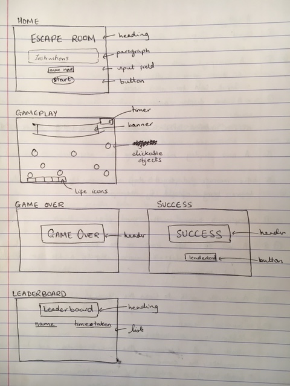
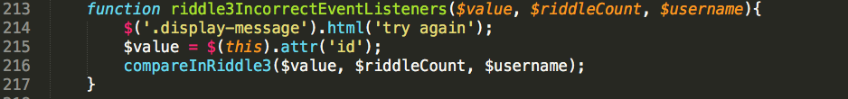

# Sparta-Core-Project-1

## [Escape Room](https://meldefern.github.io/Sparta-Core-Project-1/)

### Table of Contents
- [The Software](#the-software)
- [Task Requirements](#task-requirements)
- [Approach](#Approach)
	* [Game Idea](#game-idea)
- [Planning](#planning)
	* [Wireframe](#wireframe)
	* [User Stories](#user-stories)
	* [Acceptance Criteria](#acceptance-criteria)
- [Sprints](#sprints)
	* [Sprint One](#sprint-one)
	* [Dealing with the Sprints](#dealing-with-the-sprints)
	* [Sprint Two](#sprint-two)
	* [Sprint Three](#sprint-three)
- [What I Found Difficult](#what-i-found-difficult)
	* [Timer Implementation](#timer-implementation)
	* [Using Media Queries](#using-media-queries)
	* [Ordered Leaderboard](#ordered-leaderboard)
- [What I'm Proud Of](#what-i'm-proud-of)
- [How To Run](#how-to-run)
- [Rules](#rules)
- [Screenshots of Game](#screenshots-of-game)


## The Software
A JavaScript game built using HTML and CSS.

## Task Requirements
1. Build a browser based game.
2. Get project idea approved by trainers.
3. Include an instruction section explaining how to play the game.
4. A display message when the user has won, or display user score after the game has finished.

## Approach
### Game Idea
After being briefed that we will be presenting the game to those in the Academy, I decided to build one such that everyone in the audience can interact with to win.
Inspired by a text adventure game from a previous class, I was excited about delivering a click adventure game. Having always been intrigued by the idea of an escape room, but having never been to one, I was eager to put my skills to use.

## Planning
### Wireframe
To get my initial idea down on paper, I designed a wire frame of what I wanted it to look.



As I had objects placed in specific positions, my first approach was to use bootstrap. However, I had to rethink as my objects needed to be placed in relation to each other, and a grid layout would have caused conflicts in my arrangement.


### User Stories
Before writing my user stories, I wrote a user game flow list, setting out what I expected to happen as the player progressed through the game. I then built my user stories around the game flow, adding elements of things I wanted them to see and also be able to do.

### Acceptance Criteria
My acceptance criteria was built around the Definition of Done. I wanted the user stories to be complete, but to avoid scope creeping, i wrote what could be considered the bare minimum to achieve the result, to ensure that when a sprint was completed before time, I could return and improve on it.

## 

## Sprints
After handwriting the user stories and acceptance criteria, I typed them up on Trello, a web based project management application.

### Sprint One
My Sprint One Trello list included only what i needed to get a working game. My game consisted of many objects, so to ensure I could complete a sprint, my acceptance criteria only included those necessary, correct and incorrect, objects.

### Priorities 
With trello, I orgranised my user stories by difficulty and ordered them by priority. To quickly access the difficulty of a task and when I should begin to focus my attention on it, I added colour labels.
Using a fibonacci rating system of 1, 2, 3, 5, 8, 13, with 1 being the easiest, and 13 most difficult, I rated my user stories. This helped me focus the difficulty further down the sprints, so I wouldn't get caught up too early, but also not too late.

### Dealing with sprints
After completing a sprint item, I would drag it over to the "Done" list. Some items I left in their sprints, as I had fulfilled the acceptance criteria, but needed to be reminded to go back and add more when I had time.

### Sprint 2
I tackled slightly more difficult tasks in Sprint 2, but as my sprint 1 left me with a working game, and with 2 days to complete, I could move all my user stories over.


### Sprint 3
With no more user stories left, I wanted to extend the user experience by adding sounds, animation, a leaderboard with memory and media queries for a responsive game.


Sprint 3 after a board clean up from completing what I had left over:


## What i found difficult 

### Timer Implementation
After I decided against the bootstrap approach, the first difficulty I faced was in implementing a timer. My acceptance criteria was to allow the user to view their time taken, so after failing to deliver a running timer, I set out calculating the elapsed time, and returning it at the end of the game. Mentioning the blocker in the morning stand up, I found the other members experiencing the same difficulty. Using our trainer's simple CodePen code, we edited it to fulfill our intentions.

### Using Media Queries
When attempting to use media queries for a responsive game, I realised I had began it too close to the end of the project; I would have had little time to make changes to the consequential problems. If I had more time, I would have made a better attempt. The most straightforward advice I found to applying media queries, found [here](http://blog.sklambert.com/responsive-html5-canvas-game/), would have worked better for me had I used it in my initial build. The number of clickable objects in my game meant that a lot of CSS changes would have had to be made and a lot of time taken up.

### Ordered Leaderboard

After being unsuccessful with the media queries, I decided to work on providing the user with an ordered leaderboard. This took longer than I expected as my experience with JavaScript objects was very limited. The data I received from setting the localStorage was of type Object. To order the objects i had to store them in an array to access and sort. Accessing the data inside the objects to return proved more difficult, as the concept was felt abstract and new to me. I initially thought I could access the elements by creating multiple objects in the array, each with the username as key and time taken as value. This made it more confusing to access, as the value was entirely reliant on the undefined username. With help and advice using debugger to visually identify the object inside the array, I rewrote my object in an array, so to have the username and time accessible each by their own keys. This left the array filled with objects of size 2.

``` 
leaderboardArray =[
	player = { 
		"user": melinda,
		"score": 14
	} 
	...
}
```
Accessing the object from inside the leaderboardArray:


## What I'm Proud Of
My compareRiddle3 function, pictured below is one that i'm the most proud of, but also one of the most difficult to arrive to.



The solution to the riddle was for the user to input 4 values in sequential order. If the user made a mistake, they would lose a life, and be allowed to begin the sequence again.
My first attempt at writing the function had me storing the clicked objects inside an array and then comparing the clearing the array when necessary. I spent several hours fixing a bug where the array refused to empty after being set to null, and would not only create a new array, but the initial array would accumulate the values pushed.
After reassessing the situation, I decided to rethink the way I approached the function. I now compared the single objects with the corresponding element in the solution array. If it matched, I would push the element to an answerArray and increment the index value for the solution array to check if the next clicked object matches.
If the user clicked an incorrect object, the answerArray would reset to an empty array and the index value, for the solution array, to zero.
If the answerArray was of size 4, that meant it had been filled to match the solution array, and the riddle could complete.


## How to Run
1. Access at https://meldefern.github.io/Sparta-Core-Project-1/
2. Enter name.
3. Click.
4. Begin clicking.


## Rules
1. Solve the riddles by clicking the objects in the room.
2. Click an incorrect object and you lose a life.
3. Click a correct object and you move on to the next riddle.
4. Riddle 2 requires you to click multiple objects.
5. Riddle 3 requires you to click multiple objects but they must be clicked in the correct order.


## Screenshots of game
*Home Screen*

*Riddle 1 Gameplay*

*Riddle 2 Gameplay*

*Riddle 3 Gameplay*

*Success Screen*

*Leaderboard Screen*

*Game Over Screen*
